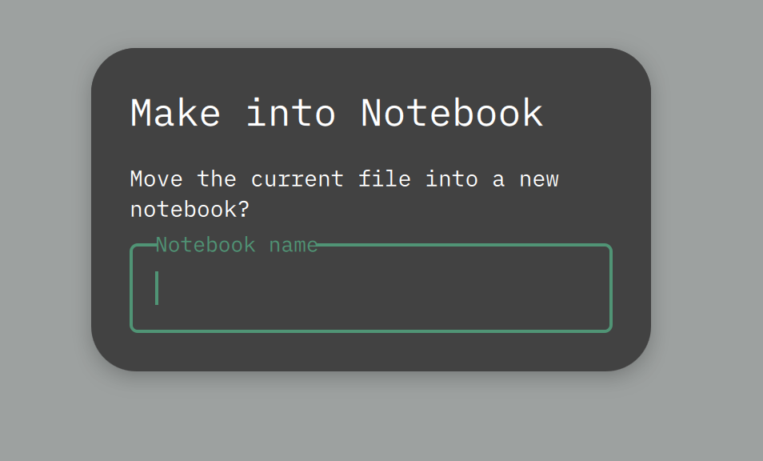
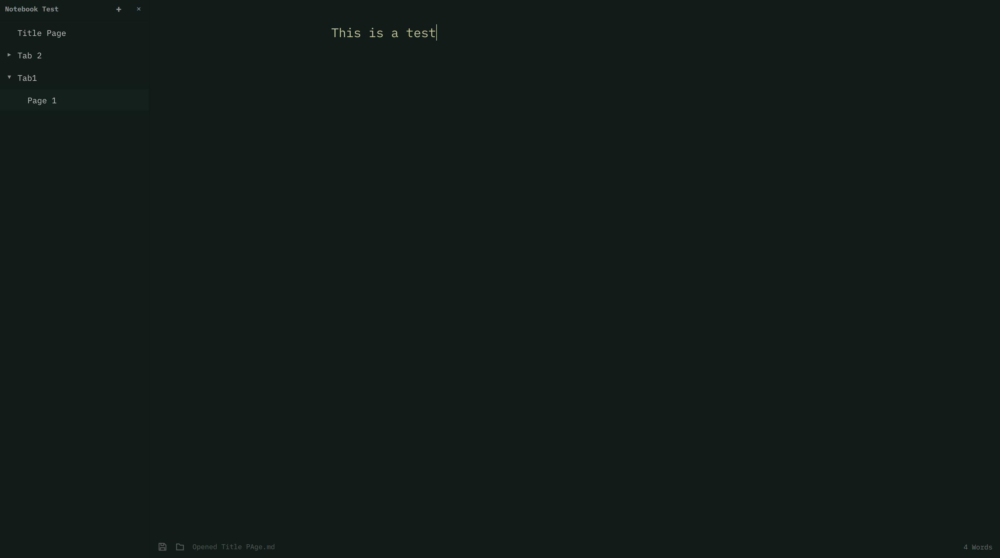

# OmaNote

A simple addition to OmaWrite (the dead-simple Markdown writing app built with Qt Quick and C++ that automatically follows system dark/light mode.)
Open it up and use it exactly like you would Omawrite. And if you want too; use the added ability to take your document and make it a Notebook with a similar workflow to OneNote. 
  * Open the sidebar menu with Ctrl+\ 
  * Convert your document to a Notebook or open an existing Notebook.

 What does converting your existing document into Notebook look like?
   * You are prompted to create a name for your Notebook
   * A folder is created in your Documents with that name and the document you are working on becomes the title page
   * From there you can add tabs and pages
   * Tabs are folders within the Notebook folder and Pages are new .md documents in the folders

## Install

TBD

## Shortcuts

- `Ctrl+S` saves. Unsaved documents use the XDG desktop portal file picker.
- `Ctrl+Shift+S` saves as.
- `Ctrl+O` opens a Markdown file through the portal picker.
- `Ctrl+N` opens a new page.
- `Ctrl+Shift+N` opens a new OmaNote window.
- `Ctrl+P` opens the system print dialog.
- `Ctrl+Z`, `Ctrl+Shift+Z`, and `Ctrl+Y` handle undo and redo.
- `Super+F` toggles fullscreen. Qt maps this key as `Meta+F`.
- `Ctrl+F` searches the document. Use `Enter` or `Ctrl+G` for the next match and `Shift+Enter` for the previous match.
- `Ctrl+H` opens find and replace.
- `Ctrl+B`, `Ctrl+I`, and `Ctrl+K` insert bold, italic, and link Markdown.
- `Ctrl+?` shows the keyboard shortcut reference.

### Notebook Shortcuts

- `Ctrl+\` toggles the sidebar.
- `Ctrl+Shift+O` opens the notebook picker.
- `Ctrl+Shift+M` converts the current document into a notebook.
- `Ctrl+Shift+T` opens a new tab (when sidebar is focused).

### Sidebar Shortcuts (when sidebar is focused)

- `Up/Down` navigate between items.
- `Enter` opens a page or expands a tab.
- `Delete` deletes the selected item.
- `F2` renames the selected item.
- `N` creates a new page in the selected tab.
- `Ctrl+Up/Down` moves a page within its tab.
- `Ctrl+Shift+Up/Down` moves a page to an adjacent tab.
- `Escape` closes the sidebar.

Unsaved drafts are recovered after an abnormal exit. OmaNote also watches open files
and warns before an external change can replace local work.

Text follows the desktop text size — `omarchy display text size`, or GNOME's
`text-scaling-factor` — and re-flows without a restart. The default of 12px leaves
OmaNote at the size it is designed around; larger and smaller sizes scale from there.

## Requirements

- Qt 6: `qt6-base`, `qt6-declarative`, `qt6-quickcontrols2`
- `xdg-desktop-portal` and a portal backend

The iA Writer Mono font is bundled under the SIL Open Font License 1.1; see
`fonts/OFL.txt`. The font is copyright Information Architects Inc. and based on
IBM Plex, copyright IBM Corp.
